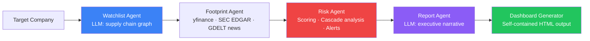

# Sentry — Vendor Risk Intelligence

> Agentic AI system for third-party and supply chain risk management.

Sentry automatically maps a target company's supply chain network across multiple tiers, aggregates financial, operational, compliance, and geopolitical risk signals from live public sources, scores each entity across four weighted dimensions, and generates a fully self-contained interactive HTML dashboard with grounded, evidence-backed AI risk narratives.

---

## Architecture



### Five Pipeline Stages

| Stage | Agent | What it does |
|---|---|---|
| 1 | Watchlist | Hybrid seed + LLM expansion: maps 2–3 level supply chain with verified tickers |
| 2 | Footprint | Parallel API calls: yfinance, SEC EDGAR, GDELT news, Wikipedia — provenance captured inline |
| 3 | Risk Scoring | Four-dimension scoring with deterministic driver strings and `DriverEvidence` provenance |
| 4 | Cascade | NetworkX graph analysis: centrality, VaR propagation, SPOF detection, HHI concentration |
| 5 | Dashboard | Jinja2 + vis.js + Plotly → single self-contained HTML file |

---

## Design Principles

**Grounding:** every score, figure, and claim on the dashboard traces back to a cited, timestamped source. Financial drivers come from yfinance and Altman Z-score computation. Compliance drivers come from live SEC EDGAR filings. Geopolitical drivers come from GDELT events and the portfolio HHI figure. No dimension renders a hardcoded placeholder.

**Explainability:** the node inspector surfaces all four dimension scores with their individual drivers, data gaps, and source links. The `mathematical_lineage` field on every node records the full VaR decomposition — direct exposure, probability, severity, and cascade contribution — so any figure on the dashboard can be traced to its inputs.

**Right tool per stage:** deterministic arithmetic handles scoring; APIs handle retrieval; the LLM handles the one task only an LLM can — synthesising a coherent risk narrative from structured evidence. The LLM narrates from drivers; it does not invent them.

---

## Quick Start (Mac — Mock Mode)

```bash
# Clone and install
git clone https://github.com/vaibhav-11/sentry-vendor-risk-intel
cd sentry-vendor-risk-intel
pip install -r requirements.txt
cp .env.example .env

# Run demo (no GPU needed)
python scripts/generate_demo.py

# Or with the CLI
python scripts/run_pipeline.py --company "Apple Inc" --backend mock --open
```

This runs the full pipeline using the mock LLM client and opens the HTML dashboard in your browser. The mock backend produces a complete, schema-valid output including stub provenance anchors and alternatives rankings — suitable for development and UI work without a GPU.

---

## ROCm / vLLM Setup

The LLM inference layer is designed for ROCm-compatible hardware running vLLM. The data collection, scoring, cascade analysis, and dashboard generation stages are CPU-only and run identically regardless of backend.

```bash
# After cloning
bash scripts/setup_amd.sh

# Terminal 1 — set ROCm environment and launch vLLM
export SYSTEM_HSA=$(find /opt/rocm/ -name "libhsa-runtime64.so*" | head -n 1)
export SYSTEM_ROCSOLVER=$(find /opt/rocm/ -name "librocsolver.so*" | head -n 1)
export SYSTEM_HIPSOLVER=$(find /opt/rocm/ -name "libhipsolver.so*" | head -n 1)
export SYSTEM_ROCSPARSE=$(find /opt/rocm/ -name "librocsparse.so*" | head -n 1)
export SYSTEM_HIPSPARSE=$(find /opt/rocm/ -name "libhipsparse.so*" | head -n 1)

export LD_LIBRARY_PATH=/opt/rocm/lib:/opt/rocm/lib64:/opt/rocm/rocsolver/lib:/opt/rocm/hipsolver/lib:/opt/rocm/rocsparse/lib:/opt/rocm/hipsparse/lib:$LD_LIBRARY_PATH
export LD_PRELOAD="$SYSTEM_HSA:$SYSTEM_ROCSOLVER:$SYSTEM_HIPSOLVER:$SYSTEM_ROCSPARSE:$SYSTEM_HIPSPARSE:$LD_PRELOAD"
export HSA_OVERRIDE_GFX_VERSION=9.4.2
export VLLM_USE_TRITON_FLASH_ATTN=1

python -m vllm.entrypoints.openai.api_server \
    --model /workspace/shared/sentry-vendor-risk-intel/models/Qwen2.5-3B-Instruct-GPTQ-Int4 \
    --quantization gptq \
    --dtype float16 \
    --max-model-len 4096 \
    --gpu-memory-utilization 0.25 \
    --host 0.0.0.0 --port 8000

# Terminal 2 — run the pipeline
python scripts/run_pipeline.py \
    --company "Apple Inc" \
    --ticker AAPL \
    --backend vllm \
    --vllm-url http://localhost:8000/v1 \
    --vllm-model /workspace/shared/sentry-vendor-risk-intel/models/Qwen2.5-3B-Instruct-GPTQ-Int4
```

**Recommended:** run the footprint/data-collection stage locally where internet egress is unrestricted, cache results to `data/cache/`, then run only the inference + scoring + render stage on the GPU host. This keeps GPU sessions short and eliminates live-network latency during inference.

---

## LLM Backends

| Backend | When to use | Config |
|---|---|---|
| `mock` | Local dev, testing, CI | Default — no model needed |
| `ollama` | Local GPU (M1/M2 Mac or consumer GPU) | Requires Ollama running |
| `vllm` | ROCm GPU (production) | Requires vLLM server on port 8000 |

Switch via `.env`:
```
LLM_BACKEND=vllm
```
Or per-run:
```bash
python scripts/run_pipeline.py --company "Tesla" --backend vllm
```

---

## Project Structure

```
sentry-vendor-risk-intel/
├── config/
│   ├── settings.py          # Centralised config (reads .env)
│   ├── prompts.py           # All LLM prompt templates
│   └── risk_weights.yaml    # Tunable risk dimension weights
├── data/
│   ├── synthetic/
│   │   └── vendor_registry.json   # Internal vendor registry + real contract spend (Apple Inc demo)
│   ├── alternatives_seed.yaml     # Pre-vetted alternatives keyed by industry
│   ├── cache/               # API response cache (gitignored)
│   └── outputs/             # Generated HTML dashboards (gitignored)
├── src/
│   ├── models.py            # All Pydantic schemas — incl. DriverEvidence, mathematical_lineage
│   ├── llm/
│   │   ├── interface.py     # Abstract base + factory
│   │   ├── mock_client.py   # Full mock (no GPU) — maintains schema parity with live backends
│   │   ├── vllm_client.py   # ROCm/vLLM backend
│   │   └── ollama_client.py # Local Ollama backend
│   ├── data_sources/
│   │   ├── yfinance_client.py   # Financial metrics + Altman Z-score + provenance anchors
│   │   ├── news_client.py       # GDELT + NewsAPI sentiment + DriverEvidence
│   │   ├── sec_edgar.py         # SEC filings + compliance driver construction
│   │   ├── wikipedia_client.py  # Company descriptions
│   │   └── aggregator.py        # Parallel fan-out + internal registry merge
│   ├── risk/
│   │   └── scorer.py        # Four-dimension scoring engine with deterministic driver strings
│   ├── graph/
│   │   ├── supply_chain_graph.py  # NetworkX graph builder
│   │   └── cascading_risk.py      # VaR propagation · HHI · SPOF detection
│   ├── agents/
│   │   ├── watchlist_agent.py  # LangGraph node: seed load + LLM expansion
│   │   ├── footprint_agent.py  # LangGraph node: data collection + provenance
│   │   ├── risk_agent.py       # LangGraph node: scoring + alternatives ranking
│   │   └── report_agent.py     # LangGraph node: executive narrative
│   ├── pipeline/
│   │   └── workflow.py      # LangGraph StateGraph orchestrator
│   └── dashboard/
│       ├── html_generator.py            # Self-contained HTML builder
│       └── templates/dashboard.html.j2  # vis.js + Plotly dashboard template
├── notebooks/
│   ├── 01_pipeline_demo.ipynb    # Step-by-step pipeline walkthrough
│   └── 02_gpu_inference.ipynb    # ROCm benchmarking + vLLM setup
├── scripts/
│   ├── run_pipeline.py    # Main CLI entry point
│   ├── generate_demo.py   # One-command demo runner
│   ├── amd_start.py       # ROCm environment bootstrap + vLLM launch helper
│   └── setup_amd.sh       # AMD environment bootstrap script
└── tests/
    └── test_risk_scorer.py  # Unit tests for scoring engine
```

---

## Dashboard

The pipeline generates a **single self-contained HTML file** — no server, no dependencies, open in any browser.

Six tabs:

| Tab | Contents |
|---|---|
| **Network** | vis.js hierarchical supply chain graph (LR layout, stable, physics-off). Nodes sized by contract spend, coloured by risk score. Click any node for the full inspector. |
| **Risk Analysis** | Vendor risk register ranked by composite score or contract value. Impact × probability scatter plot. Dimension breakdown per vendor. |
| **Playbooks** | AI-generated outreach drafts targeting the highest-risk and single-source vendors in this run. |
| **Documents** | Illustrative document ingestion roadmap. |
| **Manage** | Node management registry — add, edit, or remove supply chain entities. |
| **Guide** | Platform user guide. |

**Node inspector** (click any node): four dimension scores with individual drivers, data gaps, `DriverEvidence` source links, dimension weight legend, pre-vetted alternatives with LLM justifications, and full `mathematical_lineage` VaR decomposition.

**Data-freshness panel**: per-source retrieval timestamps and composite score deltas versus the last cached run.

---

## Risk Scoring Model

Composite score (0–100) weighted across four dimensions:

| Dimension | Weight | Key Signals |
|---|---|---|
| Financial | 30% | Altman Z-Score, revenue growth, D/E ratio, current ratio — sourced from yfinance |
| Operational | 30% | Contract spend concentration, single-source flag, BCP maturity, audit score |
| Compliance | 20% | SEC filing presence and recency (10-K, 8-K), explicit no-filings flag for non-US entities |
| Geopolitical | 20% | Country risk index (ISO-2 keyed), portfolio HHI concentration, GDELT event signals |

Weights are configurable in `config/risk_weights.yaml` — no code changes needed.

### Value-at-Risk formula

```
p_disruption = composite_score / 100
severity     = clamp(0.5 + 0.3 × single_source + 0.2 × no_alternate_available, 0, 1)
direct_VaR   = contract_spend × p_disruption × severity        # always ≤ contract_spend
cascade_VaR  = Σ (child_spend × child_composite/100 × dependency_strength)
VaR_total    = direct_VaR + cascade_VaR
```

`direct_VaR` and `cascade_VaR` are recorded separately in `mathematical_lineage` on every node.

---

## Data Sources & Provenance

| Source | What it provides | Provenance |
|---|---|---|
| yfinance | Financials, Altman Z, D/E, revenue growth | Yahoo Finance quote URL per metric |
| SEC EDGAR | 10-K / 10-Q / 8-K filing dates and URLs | Direct EDGAR document links |
| GDELT | Geopolitical event signals by country | Article URLs, per-country cache |
| Wikipedia | Company descriptions | Wikipedia page URL |

All provenance is captured **inline at fetch time** as `DriverEvidence` objects carrying `source_url` and `retrieved_at`. Foreign entities (non-US-listed) receive an explicit `"No SEC filings — non-US-listed entity"` compliance driver rather than a silent default.

---

## Seed Data Disclosure

The tier-1 Apple supply chain network (`data/seed/apple_network.json`) is a **curated seed** with manually verified tickers and ISO-2 country codes. It is used to guarantee data quality at tier-1; the LLM performs autonomous tier-2 expansion from this foundation. All other analysis — scoring, narratives, VaR, provenance — is fully automated. The seed itself is disclosed here and in the repository for transparency.

---

## Running Tests

```bash
pytest tests/ -v
```

---

## Environment Variables

See `.env.example` for all options. Key ones:

```bash
LLM_BACKEND=mock           # mock | ollama | vllm
VLLM_BASE_URL=http://localhost:8000/v1
VLLM_MODEL_NAME=./models/Qwen2.5-14B-Instruct-GPTQ-Int4
NEWS_API_KEY=               # Optional — GDELT used as free fallback
MAX_ENTITIES=80             # Cap supply chain node count
MAX_DEPTH=3                 # Supply chain depth
```

## Running Instructions

Terminal 1: 
```bash
cd /workspace/shared/sentry-vendor-risk-intel
mkdir models
cd /workspace/shared/sentry-vendor-risk-intel/models

pip install huggingface_hub --break-system-packages

huggingface-cli download Qwen/Qwen3-14B-AWQ \
    --local-dir ./Qwen3-14B-AWQ \
    --local-dir-use-symlinks False

cd /workspace/shared/sentry-vendor-risk-intel

export SYSTEM_HSA=$(find /opt/rocm/ -name "libhsa-runtime64.so*" | head -n 1)
export SYSTEM_ROCSOLVER=$(find /opt/rocm/ -name "librocsolver.so*" | head -n 1)
export SYSTEM_HIPSOLVER=$(find /opt/rocm/ -name "libhipsolver.so*" | head -n 1)
export SYSTEM_ROCSPARSE=$(find /opt/rocm/ -name "librocsparse.so*" | head -n 1)
export SYSTEM_HIPSPARSE=$(find /opt/rocm/ -name "libhipsparse.so*" | head -n 1)
export LD_LIBRARY_PATH=/opt/rocm/lib:/opt/rocm/lib64:/opt/rocm/rocsolver/lib:/opt/rocm/hipsolver/lib:/opt/rocm/rocsparse/lib:/opt/rocm/hipsparse/lib:$LD_LIBRARY_PATH
export LD_PRELOAD="$SYSTEM_HSA:$SYSTEM_ROCSOLVER:$SYSTEM_HIPSOLVER:$SYSTEM_ROCSPARSE:$SYSTEM_HIPSPARSE"
export HSA_OVERRIDE_GFX_VERSION=9.4.2

python -m vllm.entrypoints.openai.api_server \
    --model /workspace/shared/sentry-vendor-risk-intel/models/Qwen3-14B-AWQ \
    --quantization awq \
    --dtype float16 \
    --max-model-len 4096 \
    --gpu-memory-utilization 0.15 \
    --host 0.0.0.0 \
    --port 8000
```

Terminal 2:
```bash
cd /workspace/shared/sentry-vendor-risk-intel
pip install -r requirements.txt --break-system-packages
curl http://localhost:8000/v1/models  # verify server is ready first

python scripts/run_pipeline.py \
    --company "Apple Inc" \
    --ticker AAPL \
    --backend vllm \
    --vllm-url http://localhost:8000/v1 \
    --vllm-model /workspace/shared/sentry-vendor-risk-intel/models/Qwen3-14B-AWQ
```