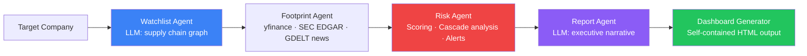

# Vendor Risk Intelligence

> Agentic AI system for third-party and vendor risk management — built for the AMD Developer Cloud Hackathon.

Automatically maps supply chain relationships, aggregates financial and operational risk signals, detects early warning indicators, and generates an interactive HTML dashboard with AI-powered risk narratives. Runs on AMD MI300X with Qwen2.5-14B via vLLM.

---

## Architecture



### Five Pipeline Stages

| Stage | Agent | What it does |
|-------|-------|-------------|
| 1 | Watchlist | LLM maps 2-3 level supply chain (suppliers, customers, partners) |
| 2 | Footprint | Parallel API calls: yfinance, SEC EDGAR, GDELT news, Wikipedia |
| 3 | Risk Scoring | Multi-dimensional scoring: Financial · Operational · Compliance · Geopolitical |
| 4 | Cascade | NetworkX graph analysis: centrality, blast radius, SPOFs |
| 5 | Dashboard | Jinja2 + vis.js + Plotly → single self-contained HTML file |

---

## Quick Start (Mac — Mock Mode)

```bash
# Clone and install
git clone https://github.com/your-username/vendor-risk-intel
cd vendor-risk-intel
pip install -r requirements.txt
cp .env.example .env

# Run demo (no GPU needed)
python scripts/generate_demo.py

# Or with the CLI
python scripts/run_pipeline.py --company "Apple Inc" --backend mock --open
```

This runs the full pipeline using the mock LLM client and opens the HTML dashboard in your browser.

---

## AMD MI300X Setup

```bash
# After cloning on AMD Developer Cloud
bash scripts/setup_amd.sh

# Start vLLM server (in a separate terminal)
python -m vllm.entrypoints.openai.api_server \
    --model ./models/Qwen2.5-14B-Instruct-GPTQ-Int4 \
    --dtype float16 \
    --max-model-len 8192 \
    --gpu-memory-utilization 0.90 &

# Run with real LLM
python scripts/run_pipeline.py --company "Apple Inc" --ticker AAPL --backend vllm --open
```

---

## LLM Backends

| Backend | When to use | Config |
|---------|------------|--------|
| `mock` | Local dev, testing, CI | Default — no model needed |
| `ollama` | Local GPU (M1/M2 Mac or consumer GPU) | Requires Ollama running |
| `vllm` | AMD MI300X (production) | Requires vLLM server on port 8000 |

Switch via `.env`:
```
LLM_BACKEND=vllm
```
Or per-run:
```bash
python scripts/run_pipeline.py --company "Tesla" --backend vllm
```

---

## Project Structure

```
vendor-risk-intel/
├── config/
│   ├── settings.py          # Centralised config (reads .env)
│   ├── prompts.py           # All LLM prompt templates
│   └── risk_weights.yaml    # Tunable risk dimension weights
├── data/
│   ├── synthetic/
│   │   └── vendor_registry.json   # Internal vendor data (Apple Inc demo)
│   ├── cache/               # API response cache (gitignored)
│   └── outputs/             # Generated HTML dashboards (gitignored)
├── src/
│   ├── models.py            # All Pydantic data schemas
│   ├── llm/
│   │   ├── interface.py     # Abstract base + factory
│   │   ├── mock_client.py   # Full mock (no GPU)
│   │   ├── vllm_client.py   # AMD MI300X backend
│   │   └── ollama_client.py # Local Ollama backend
│   ├── data_sources/
│   │   ├── yfinance_client.py   # Financial metrics + Altman Z-score
│   │   ├── news_client.py       # GDELT + NewsAPI sentiment
│   │   ├── sec_edgar.py         # SEC filings + risk flag extraction
│   │   ├── wikipedia_client.py  # Company descriptions
│   │   └── aggregator.py        # Parallel fan-out + internal registry
│   ├── risk/
│   │   └── scorer.py        # Multi-dimensional risk scoring engine
│   ├── graph/
│   │   ├── supply_chain_graph.py  # NetworkX graph builder
│   │   └── cascading_risk.py      # Centrality + blast radius analysis
│   ├── agents/
│   │   ├── watchlist_agent.py  # LangGraph node: supply chain generation
│   │   ├── footprint_agent.py  # LangGraph node: data collection
│   │   ├── risk_agent.py       # LangGraph node: scoring + alerts
│   │   └── report_agent.py     # LangGraph node: executive report
│   ├── pipeline/
│   │   └── workflow.py      # LangGraph StateGraph orchestrator
│   └── dashboard/
│       ├── html_generator.py            # Self-contained HTML builder
│       └── templates/dashboard.html.j2  # vis.js + Plotly dashboard
├── notebooks/
│   ├── 01_pipeline_demo.ipynb    # Step-by-step pipeline walkthrough
│   └── 02_gpu_inference.ipynb    # MI300X benchmarking + vLLM setup
├── scripts/
│   ├── run_pipeline.py    # Main CLI entry point
│   ├── generate_demo.py   # One-command demo runner
│   └── setup_amd.sh       # AMD environment bootstrap
└── tests/
    └── test_risk_scorer.py  # Unit tests for scoring engine
```

---

## Dashboard Output

The pipeline generates a **single self-contained HTML file** — no server, no dependencies, open in any browser.

Four interactive tabs:
- **Supply Chain Map** — vis.js network graph, nodes coloured by risk score, click for detail modal
- **Risk Scores** — ranked table + Plotly bar chart + dimension radar chart
- **Alerts** — severity-filtered alert feed with escalation routing
- **Executive Report** — LLM-generated narrative for CPO/CRO

---

## Risk Scoring Model

Composite score (0-100) weighted across four dimensions:

| Dimension | Weight | Key Signals |
|-----------|--------|-------------|
| Financial | 30% | Altman Z-Score, revenue growth, D/E ratio, liquidity |
| Operational | 30% | Spend concentration, single-source, BCP maturity, audit score |
| Compliance | 20% | Sanctions flags, certification gaps, GDPR status, SEC filings |
| Geopolitical | 20% | Country risk index, trade war exposure, political stability |

Weights are configurable in `config/risk_weights.yaml` — no code changes needed.

---

## Storage Budget (AMD 25GB)

| Item | Size |
|------|------|
| Qwen2.5-14B-GPTQ-Int4 model | ~9 GB |
| Python environment + packages | ~4 GB |
| ChromaDB vector store | ~0.5 GB |
| Data cache + outputs | ~0.5 GB |
| Code + notebooks | ~0.1 GB |
| **Total** | **~14 GB** — 11 GB headroom |

---

## Running Tests

```bash
pytest tests/ -v
```

---

## Environment Variables

See `.env.example` for all options. Key ones:

```bash
LLM_BACKEND=mock           # mock | ollama | vllm
VLLM_BASE_URL=http://localhost:8000/v1
VLLM_MODEL_NAME=./models/Qwen2.5-14B-Instruct-GPTQ-Int4
NEWS_API_KEY=               # Optional — GDELT used as free fallback
MAX_ENTITIES=80             # Cap supply chain node count
MAX_DEPTH=3                 # Supply chain depth
```

## Command 

## Terminal 1
# 1. Re-enforce your stable system preload path variables
```bash
export SYSTEM_HSA=$(find /opt/rocm/ -name "libhsa-runtime64.so*" | head -n 1)
export SYSTEM_ROCSOLVER=$(find /opt/rocm/ -name "librocsolver.so*" | head -n 1)
export SYSTEM_HIPSOLVER=$(find /opt/rocm/ -name "libhipsolver.so*" | head -n 1)
export SYSTEM_ROCSPARSE=$(find /opt/rocm/ -name "librocsparse.so*" | head -n 1)
export SYSTEM_HIPSPARSE=$(find /opt/rocm/ -name "libhipsparse.so*" | head -n 1)

export LD_LIBRARY_PATH=/opt/rocm/lib:/opt/rocm/lib64:/opt/rocm/rocsolver/lib:/opt/rocm/hipsolver/lib:/opt/rocm/rocsparse/lib:/opt/rocm/hipsparse/lib:$LD_LIBRARY_PATH
export LD_PRELOAD="$SYSTEM_HSA:$SYSTEM_ROCSOLVER:$SYSTEM_HIPSOLVER:$SYSTEM_ROCSPARSE:$SYSTEM_HIPSPARSE:$LD_PRELOAD"
export HSA_OVERRIDE_GFX_VERSION=9.4.2
export VLLM_USE_TRITON_FLASH_ATTN=1
```

# 2. Launch the standard, un-wrapped entrypoint directly
```bash
python -m vllm.entrypoints.openai.api_server \
    --model /workspace/shared/sentry-vendor-risk-intel/models/Qwen2.5-3B-Instruct-GPTQ-Int4 \
    --quantization gptq \
    --dtype float16 \
    --max-model-len 4096 \
    --gpu-memory-utilization 0.25 \
    --host 0.0.0.0 --port 8000
```

```bash
python scripts/run_pipeline.py \
    --company "Apple Inc" \
    --ticker AAPL \
    --backend vllm \
    --vllm-url http://localhost:8000/v1 \
    --vllm-model /workspace/shared/sentry-vendor-risk-intel/models/Qwen2.5-3B-Instruct-GPTQ-Int4
```


---

